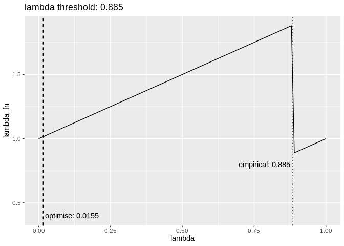

<!-- README.md is generated from README.Rmd. Please edit that file -->

# lambda

The goal of lambda is to …

## Installation

You can install lambda from github with:

``` r
# install.packages("devtools")
devtools::install_github("softloud/lambda")
```

## Example

This is a basic example which shows you how to solve a common problem:

``` r
## basic example code

# packages
library(skimr)
library(tidyverse)
#> ── Attaching packages ─────────────────────────────────────────────────────────── tidyverse 1.2.1 ──
#> ✔ ggplot2 3.0.0     ✔ purrr   0.3.0
#> ✔ tibble  1.4.2     ✔ dplyr   0.7.6
#> ✔ tidyr   0.8.1     ✔ stringr 1.3.1
#> ✔ readr   1.1.1     ✔ forcats 0.3.0
#> ── Conflicts ────────────────────────────────────────────────────────────── tidyverse_conflicts() ──
#> ✖ dplyr::filter() masks stats::filter()
#> ✖ dplyr::lag()    masks stats::lag()
library(lambda)

# for reproducibility
set.seed(38)

# grab `probability data` between 0 and 1
some_data <- runif(100)

some_data %>% skim()
#> 
#> Skim summary statistics
#> 
#> ── Variable type:numeric ───────────────────────────────────────────────────────────────────────────
#>  variable missing complete   n mean   sd    p0  p25  p50  p75 p100
#>         .       0      100 100  0.5 0.29 0.015 0.29 0.51 0.75 0.99
#>      hist
#>  ▇▂▅▅▆▅▇▅

## lambda_inf finds the infinum of the lambda function

# the original version of the function used optimise, but this does not find the correct point in the output of the function

lambda_optimise <- function(probability, alpha = 0.5) {
  optimise(
    lambda:::lambda_fn,
    interval = c(0, 1),
    prob = probability,
    alpha = alpha,
    maximum = FALSE
  ) %>%
    purrr::pluck("minimum")
}


tibble(
  lambda = seq(0, 1, by = 0.01),
  lambda_fn = map_dbl(lambda, lambda:::lambda_fn, probability = some_data)
) %>% 
  ggplot(aes(x = lambda, y = lambda_fn)) +
  geom_line() +
  geom_vline(xintercept = lambda_optimise(some_data),
             linetype = "dashed", show.legend = "optimise") +
  geom_vline(xintercept = lambda_inf(some_data), linetype = "dotted", show.legend = "empirical") +
  geom_text(data = 
              tibble(
                x = c(lambda_optimise(some_data),
                                lambda_inf(some_data)),
                y = c(0.4, 0.8),
                label = c(paste0("optimise: ",  round(lambda_optimise(some_data), 4)), 
                           paste0("empirical: ", lambda_inf(some_data)))), 
            aes(x = x, y = y, label = label),
            nudge_x = c(0.1, -0.1)) +
  labs(title = paste0("lambda threshold: ", lambda_inf(some_data)))
```

<!-- -->

The dotted line gives the output of the `optimise` approach, which
doesn’t work. The current function takes a more empirical approach, as
it were. Since the \(\lambda\) function always has this shape, we can
subdivide the interval between 0 and 1 and approximate the point, to a
certain degree of precisio (the dotted line).
